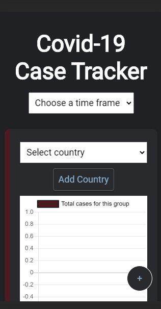
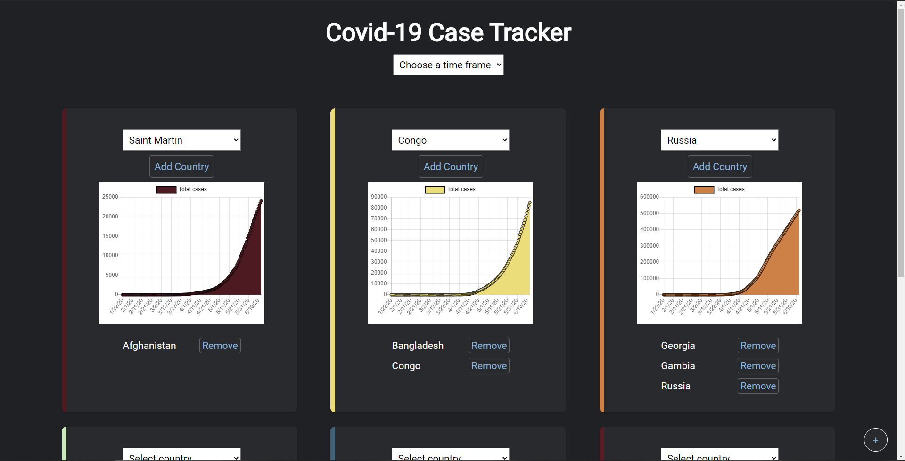
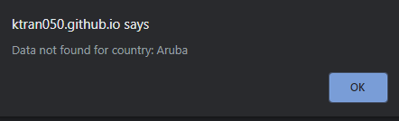
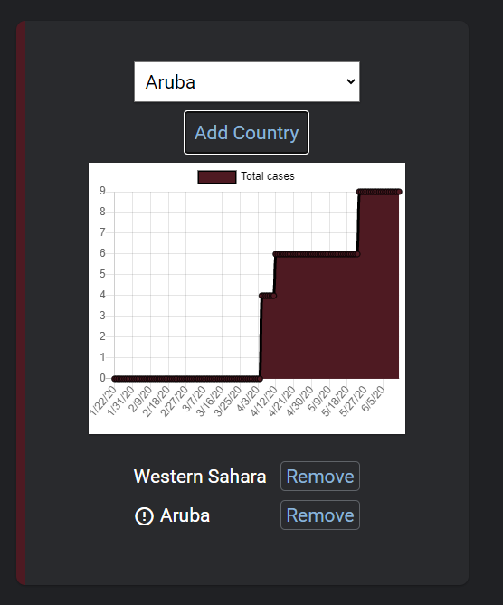

# Covid-19 Case Tracker

## Live version

https://ktran050.github.io/coronaTracker/

## Examples

### Mobile View

### Desktop View

### No data for country found

## Purpose

This application provides accurate information from John Hopkin's University about the number cases of Covid-19 from countries all around the world. Users can group countries together as well as narrow or widen the data they are viewing. JHU was chosen as a source because of their impartiality.

## Technologies used

HTML, CSS, JavaScript, and jQuery.
